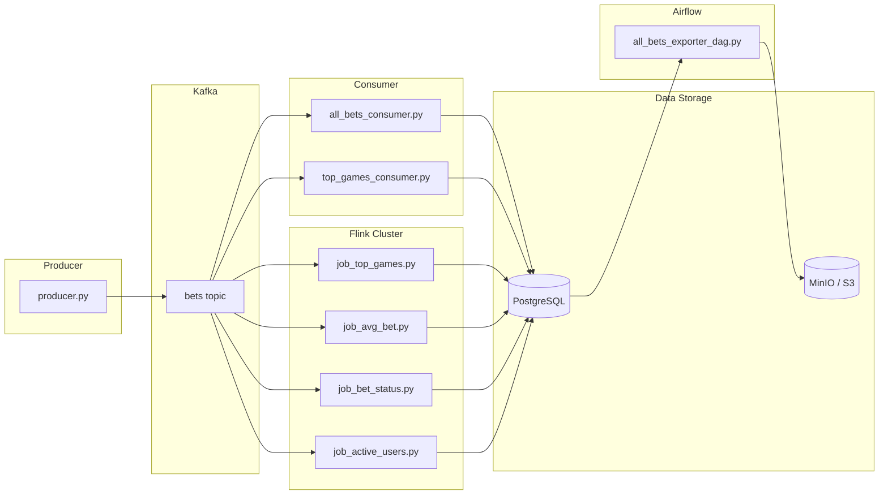

# Data Engineering Mini Project 🚀

## 📌 Описание проекта

Учебный проект демонстрирует базовый end-to-end data pipeline, включающий:

- **Kafka** — брокер сообщений для стриминга данных.
- **PostgreSQL** — хранилище данных (OLTP/аналитика).
- **MinIO** — S3-совместимое объектное хранилище (архивирование/бэкапы).
- **Apache Flink** — распределённая система обработки потоков в реальном времени.
- **Apache Airflow** — оркестрация ETL и автоматизация экспорта данных.
- **Producer** — генератор событий ставок (имитация пользователей).
- **Consumer** — сервис для загрузки «сырых» событий ставок в Postgres.
- **Flink Jobs** — вычисление и агрегация бизнес-метрик.

## ⚙️ Архитектура



- **producer** генерирует события ставок и отправляет их в Kafka (`bets` topic`).
- **Flink** читает поток данных, агрегирует метрики и пишет в Postgres.
- **consumer** сохраняет сырые данные ставок в Postgres для последующего анализа.
- **Postgres** используется для аналитики, а **MinIO** — для хранения дампов/архивации.
- **airflow** каждые 5 минут выгружает новые записи из `bets` в S3 (MinIO) в формате **Parquet**, помечая их как `exported=true`.

## 📂 Структура проекта

```
project/
├── docker-compose.yml
├── README.md
├── .gitignore
│
├── airflow/
│   ├── Dockerfile
│   ├── dags/
│   │   └── all_bets_exporter_dag.py
│   └── exporters/
│       ├── all_bets_exporter.py
│       └── __init__.py
│
├── consumer/
│   ├── Dockerfile
│   └── consumers/
│       ├── all_bets_consumer.py
│       └── top_games_consumer.py

├── flink/
│   ├── Dockerfile
│   ├── flink-conf.yml
│   ├── artifacts/
│   └── jobs/
│       ├── job_active_users.py
│       ├── job_avg_bet.py
│       ├── job_bet_status.py
│       └── job_top_games.py
│
├── postgres-init/
│   └── init.sql
│
├── producer/
│   ├── Dockerfile
│   ├── producer.py
│
└── topic-init/
    ├── Dockerfile
    └── create_topic.py
```

## 🚀 Запуск проекта

### 1. Поднять инфраструктуру

```bash
docker-compose up -d
```

### 2. Создать Kafka topic

```bash
docker-compose run --rm topic-init python create_topic.py
```

### 3. Запустить Flink jobs

```bash
docker exec -it flink-jobmanager ./bin/flink run -py /opt/flink/jobs/job_top_games.py
docker exec -it flink-jobmanager ./bin/flink run -py /opt/flink/jobs/job_avg_bet.py
docker exec -it flink-jobmanager ./bin/flink run -py /opt/flink/jobs/job_bet_status.py
docker exec -it flink-jobmanager ./bin/flink run -py /opt/flink/jobs/job_active_users.py
```

### 4. Проверить результаты

Подключиться к Postgres:

```bash
docker exec -it postgres psql -U admin -d betsdb
```

И выполнить, например:

```sql
SELECT * FROM bet_stats LIMIT 10;
```

## 📊 Метрики

- 🎮 Топ игр по количеству ставок (`job_top_games.py`)
- 💰 Средний размер ставки (`job_avg_bet.py`)
- 📈 Количество ставок по статусу (`job_bet_status.py`)
- 👤 Количество активных пользователей (`job_active_users.py`)

## 🛠️ Используемые технологии

- Python 3.10+ (Producer/Consumer/Flink jobs)
- Apache Kafka (event streaming)
- PostgreSQL (основное хранилище)
- Apache Flink (stream processing)
- MinIO (S3-compatible storage)
- Docker + Docker Compose (оркестрация)

---
