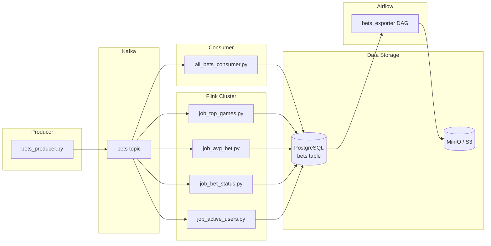

# Data Engineering Mini Project 🚀

## 📌 Описание проекта

Учебный проект демонстрирует базовый end-to-end data pipeline, включающий:

- **Kafka** — брокер сообщений для стриминга данных.
- **PostgreSQL** — хранилище данных (OLTP/аналитика).
- **MinIO** — S3-совместимое объектное хранилище (архивирование/бэкапы).
- **Apache Flink** — распределённая система обработки потоков в реальном времени.
- **Apache Airflow** — оркестрация ETL и автоматизация экспорта данных.
- **Producer** — генератор событий ставок (имитация пользователей).
- **Consumer** — сервис для загрузки «сырых» событий ставок в Postgres.
- **Flink Jobs** — вычисление и агрегация бизнес-метрик.

## ⚙️ Архитектура



- **producer** генерирует события ставок и отправляет их в Kafka (`bets` topic). Топики создаются автоматически при первой записи.
- **Flink** читает поток данных из Kafka, агрегирует метрики в реальном времени и пишет результаты в Postgres.
- **consumer** (`all_bets_consumer.py`) сохраняет сырые данные ставок в таблицу `bets` в Postgres для последующего анализа и экспорта.
- **Postgres** используется для аналитики и хранения сырых данных в таблице `bets`.
- **MinIO** (S3-совместимое хранилище) используется для долгосрочного хранения и архивации данных.
- **Airflow** каждые 5 минут автоматически выгружает новые записи из таблицы `bets` (где `exported=false`) в MinIO в формате **Parquet**, помечая их как `exported=true`.

## 📂 Структура проекта

```
project/
├── docker-compose.yml
├── README.md
├── .env                    # Файл с переменными окружения
├── .gitignore
│
├── airflow/
│   ├── Dockerfile
│   ├── entrypoint.sh       # Скрипт инициализации Airflow
│   ├── dags/
│   │   └── all_bets_exporter_dag.py
│   └── exporters/
│       ├── __init__.py
│       └── all_bets_exporter.py
│
├── consumer/
│   ├── Dockerfile
│   └── consumers/
│       ├── all_bets_consumer.py  # Сохраняет данные в bets2
│       └── top_games_consumer.py # (не используется в текущей конфигурации)

├── flink/
│   ├── Dockerfile
│   ├── flink-conf.yml
│   ├── artifacts/          # JAR файлы для Flink коннекторов
│   └── jobs/
│       ├── job_active_users.py
│       ├── job_avg_bet.py
│       ├── job_bet_status.py
│       └── job_top_games.py
│
├── postgres-init/
│   └── init.sql            # SQL скрипты для инициализации БД
│
└── producer/
    ├── Dockerfile
    └── bets_producer.py    # Генератор событий ставок
```

## 🚀 Запуск проекта

### Предварительные требования

1. Установить [Docker](https://www.docker.com/get-started) и [Docker Compose](https://docs.docker.com/compose/install/)
2. Сгенерировать FERNET_KEY для Airflow (для шифрования паролей в БД):
   ```bash
   python -c "from cryptography.fernet import Fernet; print(Fernet.generate_key().decode())"
   ```
   Скопируйте полученный ключ - он понадобится для файла `.env`
3. Создать файл `.env` в корне проекта с необходимыми переменными окружения:

```env
# PostgreSQL
POSTGRES_USER=admin
POSTGRES_PASSWORD=admin
POSTGRES_DB=bets_db
POSTGRES_HOST=postgres

# Kafka
KAFKA_BROKER=kafka:9092
TOPIC_NAME=bets

# MinIO/S3
MINIO_ROOT_USER=minioadmin
MINIO_ROOT_PASSWORD=minioadmin
S3_BUCKET=bets
S3_ENDPOINT=http://minio:9000
S3_ACCESS_KEY=minioadmin
S3_SECRET_KEY=minioadmin

# Airflow
AIRFLOW__CORE__FERNET_KEY=your_fernet_key_here  # Используйте ключ, сгенерированный на шаге 2
AIRFLOW__CORE__EXECUTOR=LocalExecutor
AIRFLOW_ADMIN_USERNAME=admin
AIRFLOW_ADMIN_PASSWORD=admin
AIRFLOW_ADMIN_EMAIL=admin@example.com

# PgAdmin
PGADMIN_DEFAULT_EMAIL=admin@example.com
PGADMIN_DEFAULT_PASSWORD=admin
```

### 1. Поднять инфраструктуру

```bash
docker-compose up -d
```

Все сервисы запустятся автоматически. Kafka автоматически создаст топик `bets` при первой записи (благодаря `KAFKA_AUTO_CREATE_TOPICS_ENABLE: "true"`).

### 2. Проверить статус сервисов

```bash
docker-compose ps
```

Убедитесь, что все сервисы работают (Status: Up).

### 3. Запустить Flink jobs

После того как все сервисы запущены, можно запустить Flink jobs:

```bash
docker exec -it jobmanager /opt/flink/bin/flink run -py /opt/flink/jobs/job_top_games.py
docker exec -it jobmanager /opt/flink/bin/flink run -py /opt/flink/jobs/job_avg_bet.py
docker exec -it jobmanager /opt/flink/bin/flink run -py /opt/flink/jobs/job_bet_status.py
docker exec -it jobmanager /opt/flink/bin/flink run -py /opt/flink/jobs/job_active_users.py
```

Проверить статус jobs можно через Flink UI: http://localhost:8081

### 4. Проверить результаты

#### В PostgreSQL:

```bash
docker exec -it postgres psql -U ${POSTGRES_USER} -d ${POSTGRES_DB}
```

Примеры запросов:

```sql
-- Сырые данные ставок
SELECT * FROM bets LIMIT 10;

-- Статистика по играм (Flink job)
SELECT * FROM bet_stats LIMIT 10;

-- Проверить экспортированные записи
SELECT COUNT(*) FROM bets WHERE exported = true;
SELECT COUNT(*) FROM bets WHERE exported = false;
```

#### В Airflow:

- Откройте http://localhost:8080
- Войдите с учетными данными из `.env` файла
- Найдите DAG `bets_exporter` и убедитесь, что он активен
- DAG запускается автоматически каждые 5 минут

#### В MinIO:

- Откройте http://localhost:9001
- Войдите с учетными данными из `.env` файла
- Проверьте бакет `bets` (создается автоматически при первом экспорте)
- Файлы сохраняются в формате: `raw/YYYY-MM-DD/part-HHMMSS.parquet`

#### В Kowl (Kafka UI):

- Откройте http://localhost:9002
- Просмотрите топик `bets` и сообщения в реальном времени

## 📊 Метрики и данные

### Flink Jobs (реал-тайм агрегация):

- 🎮 **Топ игр** по количеству ставок (`job_top_games.py`)
- 💰 **Средний размер ставки** (`job_avg_bet.py`)
- 📈 **Количество ставок по статусу** (`job_bet_status.py`)
- 👤 **Количество активных пользователей** (`job_active_users.py`)

### Хранилища данных:

- **PostgreSQL (`bets` таблица)**: Сырые данные ставок с полной информацией о пользователях, событиях и метаданных
- **MinIO/S3**: Архивные данные в формате Parquet, организованные по датам (`raw/YYYY-MM-DD/`)

### Процесс экспорта:

1. **Consumer** получает события из Kafka и сохраняет в `bets` с флагом `exported=false`
2. **Airflow DAG** (`bets_exporter`) каждые 5 минут:
   - Выбирает записи где `exported=false`
   - Конвертирует в Parquet формат
   - Загружает в MinIO
   - Обновляет флаг `exported=true`

## 🛠️ Используемые технологии

- **Python 3.10+** — Producer, Consumer, Flink jobs, Airflow DAGs
- **Apache Kafka 4.0.1** — брокер сообщений для стриминга событий
- **PostgreSQL 15** — основное хранилище данных (OLTP)
- **Apache Flink 1.17.2** — обработка потоков данных в реальном времени
- **Apache Airflow 2.10.3** — оркестрация ETL процессов и планирование задач
- **MinIO** — S3-совместимое объектное хранилище для архивов
- **Docker + Docker Compose** — оркестрация и контейнеризация сервисов
- **Kowl** — UI для просмотра Kafka топиков и сообщений
- **PgAdmin** — веб-интерфейс для управления PostgreSQL

## 🔧 Компоненты системы

| Компонент | Назначение | Порт |
|-----------|-----------|------|
| Producer | Генерация событий ставок | - |
| Kafka | Брокер сообщений | 9092 |
| Consumer | Сохранение сырых данных в PostgreSQL | - |
| Flink JobManager | Управление Flink jobs | 8081 |
| Flink TaskManager | Выполнение Flink jobs | - |
| PostgreSQL | База данных | 5432 |
| MinIO | S3-хранилище | 9000 (API), 9001 (UI) |
| Airflow | Оркестрация ETL | 8080 |
| Kowl | Kafka UI | 9002 |
| PgAdmin | PostgreSQL UI | 5050 |

## 📝 Важные замечания

1. **Таблица `bets`** создается автоматически консьюмером при первом запуске
2. **Kafka топики** создаются автоматически при первой записи
3. **MinIO бакет** создается автоматически Airflow DAG при первом экспорте
4. **Airflow** требует правильной настройки `AIRFLOW__CORE__FERNET_KEY` для безопасности
5. Все переменные окружения должны быть указаны в файле `.env`

## 🐛 Решение проблем

### Airflow не видит DAG
- Проверьте логи: `docker-compose logs airflow`
- Убедитесь, что DAG файл не содержит синтаксических ошибок
- Проверьте, что все импорты доступны (особенно модуль `exporters`)

### MinIO ошибки доступа
- Проверьте переменные `S3_ACCESS_KEY` и `S3_SECRET_KEY` в `.env`
- Убедитесь, что они совпадают с `MINIO_ROOT_USER` и `MINIO_ROOT_PASSWORD`
- Проверьте, что `S3_ENDPOINT` указывает на `http://minio:9000`

### Проблемы с подключением к PostgreSQL
- Проверьте, что контейнер PostgreSQL запущен: `docker-compose ps postgres`
- Убедитесь, что переменные окружения корректны
- Проверьте логи: `docker-compose logs postgres`

---
